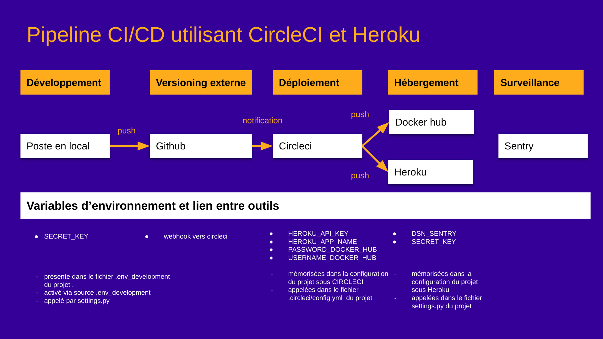
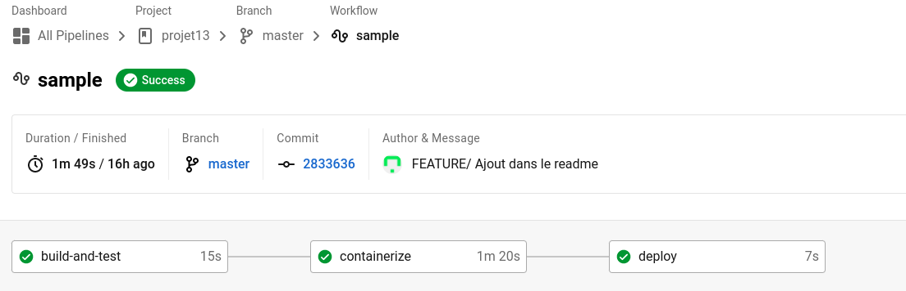

## Résumé

Site web d'Orange County Lettings

## Développement local

### Prérequis

- Compte GitHub avec accès en lecture à ce repository
- Git CLI
- SQLite3 CLI
- Interpréteur Python, version 3.6 ou supérieure

Dans le reste de la documentation sur le développement local, il est supposé que la commande `python` de votre OS shell exécute l'interpréteur Python ci-dessus (à moins qu'un environnement virtuel ne soit activé).

### macOS / Linux

#### Cloner le repository

- `cd /path/to/put/project/in`
- `git clone https://github.com/OpenClassrooms-Student-Center/Python-OC-Lettings-FR.git`

#### Créer l'environnement virtuel

- `cd /path/to/Python-OC-Lettings-FR`
- `python -m venv venv`
- `apt-get install python3-venv` (Si l'étape précédente comporte des erreurs avec un paquet non trouvé sur Ubuntu)
- Activer l'environnement `source venv/bin/activate`
- Confirmer que la commande `python` exécute l'interpréteur Python dans l'environnement virtuel
`which python`
- Confirmer que la version de l'interpréteur Python est la version 3.6 ou supérieure `python --version`
- Confirmer que la commande `pip` exécute l'exécutable pip dans l'environnement virtuel, `which pip`
- Pour désactiver l'environnement, `deactivate`

#### Exécuter le site

- `cd /path/to/Python-OC-Lettings-FR`
- `source venv/bin/activate`
- `pip install --requirement requirements.txt`
- `python manage.py runserver`
- Aller sur `http://localhost:8000` dans un navigateur.
- Confirmer que le site fonctionne et qu'il est possible de naviguer (vous devriez voir plusieurs profils et locations).

#### Linting

- `cd /path/to/Python-OC-Lettings-FR`
- `source venv/bin/activate`
- `flake8`

#### Tests unitaires

- `cd /path/to/Python-OC-Lettings-FR`
- `source venv/bin/activate`
- `pytest`

#### Base de données

- `cd /path/to/Python-OC-Lettings-FR`
- Ouvrir une session shell `sqlite3`
- Se connecter à la base de données `.open oc-lettings-site.sqlite3`
- Afficher les tables dans la base de données `.tables`
- Afficher les colonnes dans le tableau des profils, `pragma table_info(Python-OC-Lettings-FR_profile);`
- Lancer une requête sur la table des profils, `select user_id, favorite_city from
  Python-OC-Lettings-FR_profile where favorite_city like 'B%';`
- `.quit` pour quitter

#### Panel d'administration

- Aller sur `http://localhost:8000/admin`
- Connectez-vous avec l'utilisateur `admin`, mot de passe `Abc1234!`

### Windows

Utilisation de PowerShell, comme ci-dessus sauf :

- Pour activer l'environnement virtuel, `.\venv\Scripts\Activate.ps1` 
- Remplacer `which <my-command>` par `(Get-Command <my-command>).Path`

### Docker

##### Faire tourner l'application en local grace à docker

Prérequis; 
Avoir installé docker 

Récupérer une image présente sur le dockerhub
```bash
docker pull delphinepythonique/oc-lettings:lastest
```  

Créer et activer un container à partir de l'image uploadée
```bash
docker  container run --env-file .env_variables_development -p [port de l\'hôte']:8000 -d delphinepythonique/oc-lettings:lastest
```  

ou utiliser la commande docker-compose: 
pre-requis: docker compose est installé

```bash
docker-compose up
```  

### Vue d'ensemble de l'architecture CI/CD

Ce projet nécessite d'avoir accès à
[docker hub](https://hub.docker.com/),
[circleci](https://circleci.com/), 
[github](https://github.com/), 
[heroku](https://dashboard.heroku.com/apps), 
[sentry](https://sentry.io/), 

.

#### Configuration du déploiement

##### Sentry
- S'authentifier au niveau de l'url https://sentry.io/
- Cliquer sur Create Project
- Sélectionner la platform Django
- Paramétrer vos alertes
- Saisir le nom de votre projet à surveiller dans Sentry (dans le cadre de ce projet)
- Suivre les instructions *configure django*
- remplacer la valeur du dsn par la variable "DSN_SENTRY" (voir le settings.py du projet sous github)
cette variable sera reprise comme variable d'environnement dans Heroku
Dans Sentry, elle sera accéssible via Sentry > Projects > [le projet] [la roue crantée en haut à droite]> clients keys DSN (dans le menu gauche), 

##### Heroku, 

###### Préparation du fichier settings.py du projet pour un usage de Heroku
Le fichier de settings.py des sources a été actualisé pour tenir compte de HEROKU notamment grâce aux instructions suivante

```python 
IS_HEROKU = "DYNO" in os.environ
```

Chaque instruction sous condition **if IS_HEROKU:** est utilisé pour HEROKU; notamment
```python 
if IS_HEROKU:
    django_heroku.settings(
        locals(), db_colors=False, databases=False, test_runner=False
    )
```
Cette instruction permet de gérer correctement les fichiers statiques.

nota: Le paramètre databases=False empêche une erreur lors du déploiement dûe au fait que 
*django_heroku* entraine la prise en charge d'une base postgresql sans que celle ci soit configurée ; 
dans le contexte de ce projet SQLITE est utilisée. 


###### Configuration Heroku
Installation
- Accéder à l'url https://dashboard.heroku.com/apps
- cliquer sur le bouton New en haut à droite
- Renseigner les informations demandées puis cliquer sur *Create app*
dans le cadre de ce projet, le nom de l'application est oc-lettings-2023
- Cliquer sur le projet puis Settings 
- Au niveau du groupe Config Vars, ajouter les variables suivantes : 

  - DSN_SENTRY: générée lors de la création du projet dans Sentry voir configuration de Sentry
  - SECRET_KEY: Clé secrete du projet Django; reprendre le nom de variable utilisé dans le fichier Settings.py de Django

Récupération de la clé d'API 
- Cliquer sur l'avatar de votre profil 
- Cliquer sur *Account Settings*
- Au niveau du groupe API key cliquer sur *generate API Key*
cette clé sera reprise dans les variables d'environnement de CircleCI

Au niveau du dépôt github dans le répertoire project13, les fichiers Procfile et runtime.txt sont utilisés lors du déploiement dans Heroku.

Via CircleCI, 

- Accéder à l'url https://circleci.com/
- Au niveau du bouton "Log In With Github", cliquer sur la *flèche* descendante
- Cliquer sur "Public Repo Only"
- Sélectionner l'organisation contenant le dépot
la liste des dépôts de l'organisation s'affiche
- Repérer la ligne du dépôt dont vous souhaitez paramétrer la CI/CD
- Cliquer sur le bouton "Set Up Project"
Cela a pour effet d'ajouter un webhook au niveau de votre projet github, visible via Github > [votre dépot] ( ici DelphinePythonique/projet13) >Settings > Webhooks
- Sélectionner l'option *Fastest*: Use the .circleci/config.yml
Le fichier *.circleci/config* correspond au fichier présent dans votre dépôt github
Ce fichier décrit la suite d'instruction à exécuter par le pipeline de CircleCI
par la suite vous pourrez constater sa prise en compte en cliquant sur "..." au niveau du projet dans CircleCI > Configuration File
- Cliquer sur "..." au niveau du projet dans CircleCI
- Cliquer sur Project Settings
- Au niveau du menu gauche, cliquer sur Environment Variables
- Ajouter les variables d'environnement suivantes : 
  - HEROKU_API_KEY: cet clé correspond à la clé générée plus haut paragraphe configuration Heroku
  - HEROKU_APP_NAME : nom de votre application dans Heroku
  - PASSWORD_DOCKER_HUB_OPENCLASSROOMS: votre mot de passe Docker Hub
  - USERNAME_DOCKER_HUB_OPENCLASSROOMS: votre identifiant Docker Hub
Ces différentes variables sont utilisées dans le fichier .circleci/config.yml; respectivement pour le déploiement sur Heroku et le "push" de l'image sur le Docker Hub

#### Déployer  

- Pousser une modification sur la branche *master* du dépôt github.
CircleCi est notifié. Au niveau du fichier de configuration circleci > clé workflows, nous constatons que
les déploiements se font uniquement lors de poussé sur la branche master
```yml 
 - deploy:
          filters:
            branches:
              only: master
```
Une nouvelle pipeline est générée 

.

#### restaurer une application supprimée sous HEROKU
##### Heroku: 
 - Créer une nouvelle application dans Heroku (cf. Configuration Heroku > installation )

Côté CircleCI: 
 - Se positionner sur la dernière pipeline ayant réussi  
 - Cliquer sur la petite fleche en forme de cercle "rerun workflow from start"
